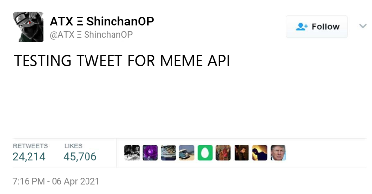

# Welcome

## **Installation** <a id="installation"></a>
[discord](https://discord.gg/emD44ZJaSA)

```text
npm install memer-api
```

## **Features**

* **Super simple**
* **Easy to use** 
* **More than 40 methods.**
* **Beginner-friendly** 
* **Great Support**
* **Flexible**

## Join our Discord server

## Examples

```text
const Meme = require("meme-api");
const memer = new Meme()
const avatar = "https://cdn.discordapp.com/embed/avatars/0.png"
memer.jail(avatar).then(jail=> {
    //send to a channel 
})
```

## PREVIEWS




